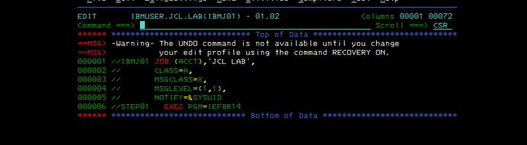
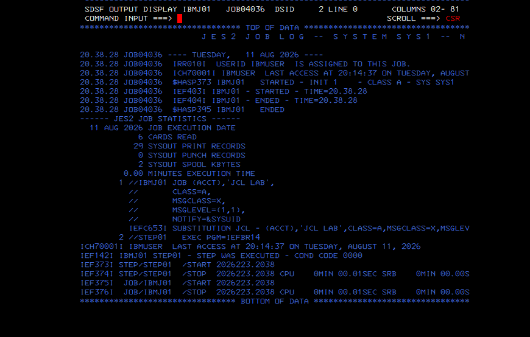
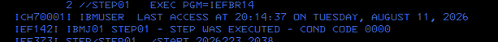
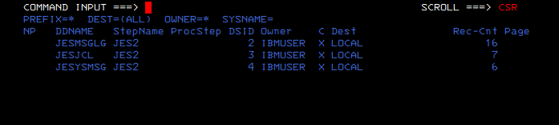
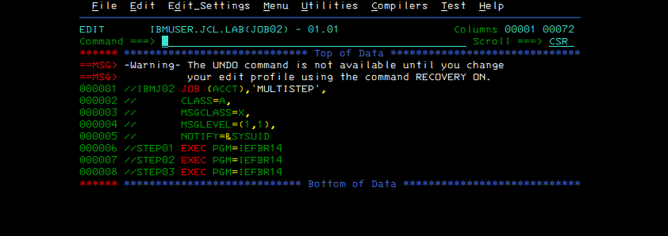
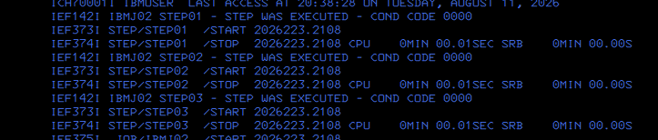
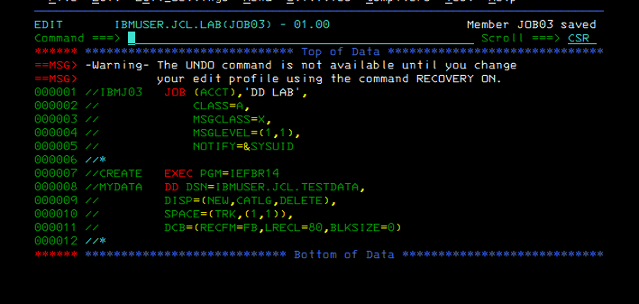
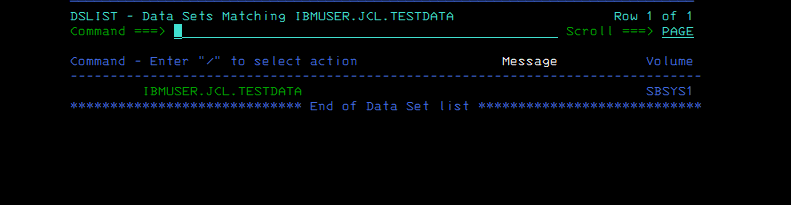

# Lab 01 - JCL Fundamentals: JOB, EXEC, DD and JES2

## Objective

Build and execute a small set of JCL jobs on a real z/OS ADCD system in order to understand the basic JCL execution hierarchy:

```text
JOB
  -> EXEC / STEP
      -> DD
          -> data set or system resource
```

The lab validates the syntax and behavior through JES2 and SDSF rather than treating JCL as syntax-only theory.

## Environment

- IBM z/OS ADCD 1.11
- JES2
- TSO/ISPF
- SDSF
- User ID: `IBMUSER`
- JCL library: `IBMUSER.JCL.LAB`
- Test data set: `IBMUSER.JCL.TESTDATA`

## Concepts covered

### JOB statement

The `JOB` statement identifies the batch job and supplies job-level parameters.

```jcl
//IBMJ01   JOB (ACCT),'JCL LAB',
//             CLASS=A,
//             MSGCLASS=X,
//             MSGLEVEL=(1,1),
//             NOTIFY=&SYSUID
```

Key parameters used in the lab:

- `CLASS=A` - selects the JES execution class configured by this installation.
- `MSGCLASS=X` - selects the output class for job output.
- `MSGLEVEL=(1,1)` - requests detailed JCL and allocation/execution messages.
- `NOTIFY=&SYSUID` - notifies the submitting TSO user when the job completes.

A practical syntax lesson was also observed during the lab: when a JCL statement continues onto another line, the previous parameter line must be syntactically continued. A missing comma after `MSGCLASS=X` caused `IEFC605I UNIDENTIFIED OPERATION FIELD` and `IEFC452I ... JOB NOT RUN - JCL ERROR`. Correcting the comma allowed JES2 to interpret the continued JOB statement correctly.

## Exercise 1 - Single-step job

`JOB01` executes `IEFBR14` in one step.

```jcl
//STEP01   EXEC PGM=IEFBR14
```

This demonstrates the basic relationship:

```text
IBMJ01 (JOB)
  -> STEP01 (EXEC)
      -> IEFBR14 (program)
```

### Result

SDSF/JES output confirms that `STEP01` executed with `COND CODE 0000`.







The SDSF output list also exposes the standard JES output data sets, including `JESMSGLG`, `JESJCL`, and `JESYSMSG`.



## Exercise 2 - Multi-step job

`JOB02` demonstrates that one JOB can contain multiple EXEC steps.

```jcl
//STEP01   EXEC PGM=IEFBR14
//STEP02   EXEC PGM=IEFBR14
//STEP03   EXEC PGM=IEFBR14
```

Execution model:

```text
IBMJ02
  |-- STEP01 -> IEFBR14
  |-- STEP02 -> IEFBR14
  `-- STEP03 -> IEFBR14
```

### Result

All three steps executed successfully with condition code `0000`. This demonstrates that a job is a container for one or more independently reported execution steps.





## Exercise 3 - DD statement and data set allocation

`JOB03` adds a `DD` statement and uses JCL to allocate a new sequential data set.

```jcl
//CREATE   EXEC PGM=IEFBR14
//MYDATA   DD  DSN=IBMUSER.JCL.TESTDATA,
//             DISP=(NEW,CATLG,DELETE),
//             SPACE=(TRK,(1,1)),
//             DCB=(RECFM=FB,LRECL=80,BLKSIZE=0)
```

### DD parameters

- `MYDATA` - logical DDNAME used by the step.
- `DSN=IBMUSER.JCL.TESTDATA` - physical/cataloged data set name.
- `DISP=(NEW,CATLG,DELETE)` - create a new data set; catalog it after normal completion; delete it after abnormal completion.
- `SPACE=(TRK,(1,1))` - request one primary track and one secondary track.
- `RECFM=FB` - fixed blocked records.
- `LRECL=80` - logical record length of 80 bytes.
- `BLKSIZE=0` - allow the system to select an appropriate block size.

### Result

The job completed with condition code `0000`. ISPF 3.4 subsequently showed `IBMUSER.JCL.TESTDATA` cataloged on volume `SBSYS1`, proving that the DD allocation and normal `CATLG` disposition occurred as intended.





## What this lab demonstrates

The three exercises establish the core JCL model:

```text
JCL source
   |
   v
JOB statement
   |
   v
EXEC step(s)
   |
   v
Program execution
   |
   +--> DD definitions -> data sets/resources
   |
   v
JES2 processing
   |
   v
SDSF / JES output
   |
   v
Condition Code 0000
```

The lab also demonstrates an important operational workflow: submit JCL, inspect JES2/SDSF output, diagnose syntax errors from IBM message IDs, correct the source, resubmit, and verify the resulting system state.

## Files

```text
01-jcl-fundamentals/
|-- README.md
|-- jcl/
|   |-- JOB01.jcl
|   |-- JOB02.jcl
|   `-- JOB03.jcl
`-- evidence/
    |-- 01-job01-source.png
    |-- 02-job01-cc0000.png
    |-- 03-job01-step-cc0000.png
    |-- 04-job01-jes-output-classes.png
    |-- 05-job02-multistep-source.png
    |-- 06-job02-three-steps-cc0000.png
    |-- 07-job03-dd-allocation-source.png
    `-- 08-testdata-cataloged-sbsys1.png
```

## Status

**Completed successfully.**

- JOB statement validated
- EXEC/STEPNAME/PGM execution validated
- Multi-step execution validated
- JES2/SDSF output inspected
- DD/DSN/DISP/SPACE/DCB allocation validated
- New data set cataloged successfully
- Final executions completed with condition code `0000`
