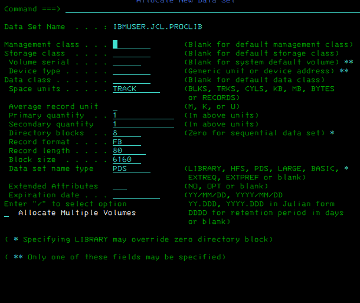
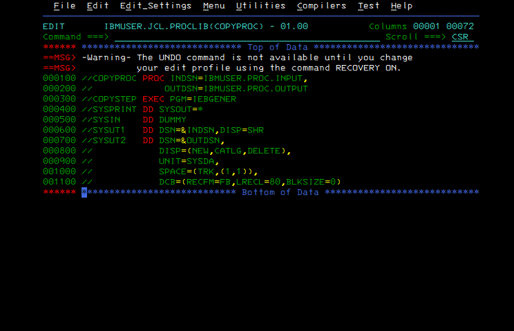
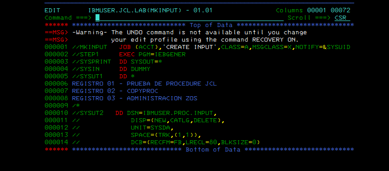
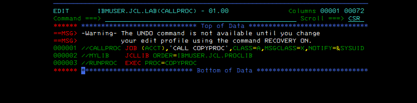
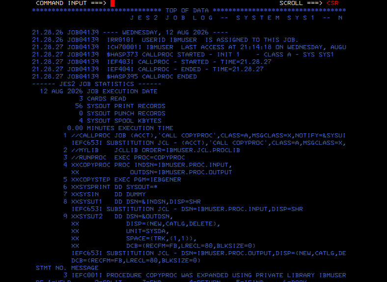
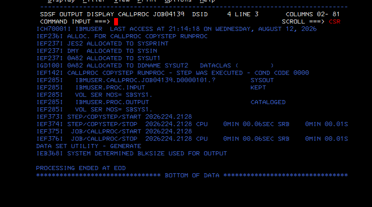
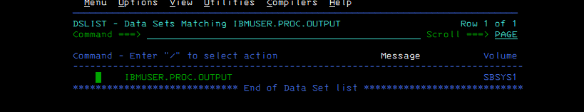
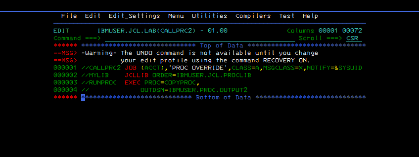
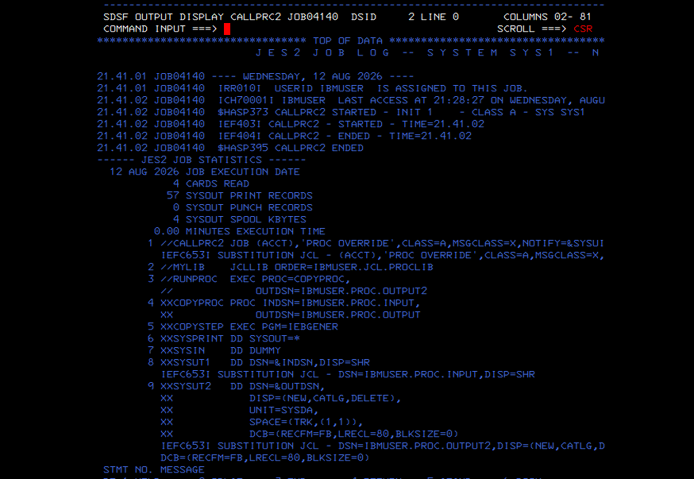
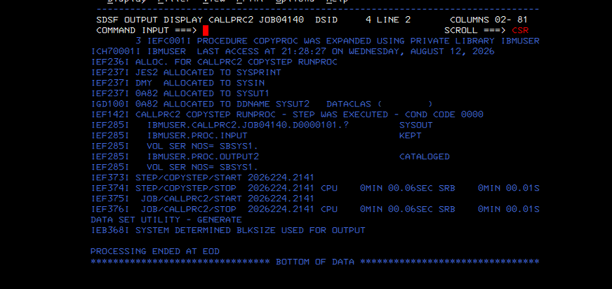

# Evidence Walkthrough — Lab 02

[← Lab lesson](../README.md) · [Academy lab standard](https://github.com/P-dot/P-dot/blob/main/docs/LAB-STANDARD.md)

This evidence set follows one idea from definition to JES2 execution: place reusable JCL in a private procedure library, call it through JCLLIB, let JES expand the procedure, then override one symbolic parameter without modifying the procedure itself.

## Evidence chain

    private PROCLIB
          |
       COPYPROC
     INDSN / OUTDSN
          |
       JCLLIB ORDER
          |
       EXEC PROC=
          |
    JES2 substitution
          |
       IEBGENER
          |
    output cataloged
          |
    OUTDSN override
          |
    second output cataloged

### Evidence 01 — allocate the procedure library

**Observe:** IBMUSER.JCL.PROCLIB is allocated as a partitioned data set with directory space and FB/80 characteristics.

**Interpret:** a cataloged procedure is a member of a library. The library is the reusable source; the caller later tells JES where to search for it.

**Why it matters:** this separates reusable execution logic from individual jobs.

### Evidence 02 — define COPYPROC

**Observe:** COPYPROC declares symbolic INDSN and OUTDSN values and executes IEBGENER. SYSUT1 consumes &INDSN; SYSUT2 creates &OUTDSN.

**Interpret:** the ampersand names are placeholders resolved when the procedure is instantiated. DISP=(NEW,CATLG,DELETE) also makes output disposition part of the reusable procedure.

**Boundary:** editing a PROC successfully does not prove that JES can locate or execute it.

### Evidence 03 — create deterministic input

**Observe:** MKINPUT feeds three in-stream records to IEBGENER and creates IBMUSER.PROC.INPUT.

**Interpret:** the test has controlled source data, so later procedure behavior can be validated against a known input.

### Evidence 04 — call the cataloged procedure

**Observe:** JCLLIB ORDER=IBMUSER.JCL.PROCLIB establishes the private procedure search library and EXEC PROC=COPYPROC invokes the member without supplying overrides.

**Interpret:** the caller is intentionally small. Procedure defaults provide both data-set names.

## What JES does here

    submitted CALLPROC
          |
          v
    JES reads JCLLIB
          |
          v
    locate COPYPROC member
          |
          v
    expand PROC statements
          |
          v
    substitute symbolic values
          |
          v
    execute generated IEBGENER step

The procedure is not a separately running program. It is reusable JCL that becomes part of the job's effective JCL before execution.

### Evidence 05 — JESJCL exposes the effective job

**Observe:** JESJCL contains the expanded COPYPROC statements and IEFC653I substitution messages. The symbolic input/output names have become concrete DSNs.

**Interpret:** this is the strongest evidence for the lesson's central concept: the submitted caller and the effective expanded JCL are not textually identical.

**Why it matters:** in production troubleshooting, JESJCL is where a learner can verify what procedure and symbolic values JES actually used.

### Evidence 06–07 — validate execution and catalog state

**Observe:** COPYSTEP ends with condition code 0000; IEF285I reports IBMUSER.PROC.OUTPUT as cataloged; ISPF DSLIST then shows the data set.

**Interpret:** three layers agree: the program step completed, z/OS disposition processing cataloged the output, and the cataloged object is visible afterward.

**Boundary:** CC 0000 alone would not prove that the expected final data-set state was produced.

### Evidence 08 — override only OUTDSN

**Observe:** CALLPRC2 still invokes COPYPROC but supplies OUTDSN=IBMUSER.PROC.OUTPUT2.

**Interpret:** only the named symbolic is replaced. INDSN continues to use the PROC default.

### Evidence 09 — see default plus override in JESJCL

**Observe:** JESJCL preserves the PROC's symbolic definitions while substitution output resolves SYSUT1 to IBMUSER.PROC.INPUT and SYSUT2 to IBMUSER.PROC.OUTPUT2.

**Interpret:** this shows why symbolic procedures scale: one tested procedure can be reused while callers vary controlled inputs.

### Evidence 10 — validate the overridden execution

**Observe:** the step again ends with condition code 0000 and IBMUSER.PROC.OUTPUT2 is reported cataloged.

**Interpret:** the override changed the requested resource without requiring a second copy of the IEBGENER procedure.

## What this lab proves

**Validated:** private JCLLIB lookup, cataloged PROC invocation, symbolic default substitution, a caller override, successful IEBGENER execution and cataloged output.

**Not claimed:** enterprise PROCLIB concatenation design, scheduler variable substitution, RACF authorization design, or application-specific procedures.

## Knowledge check

1. Why is COPYPROC not a separately executing program?
2. Where can you inspect the JCL after procedure expansion?
3. If CALLPRC2 overrides OUTDSN only, where does INDSN come from?
4. Why is CC 0000 weaker evidence than CC 0000 plus catalog verification?
5. What responsibility belongs to a scheduler rather than to this procedure?

---
### Continue learning

**Previous:** [Lab 01 — JCL fundamentals](../../01-jcl-fundamentals/)  
**Course:** [JCL Engineering Labs](../../../README.md)  
**Next:** [Lab 03 — in-stream procedures](../../03-jcl-instream-procedures/)  
**Related:** [Workload Automation](https://github.com/P-dot/zos-batch-scheduler) · [TSO/ISPF](https://github.com/P-dot/MVS_TSO_ISPF)  
**Academy:** [z/OS Engineering Academy](https://github.com/P-dot/P-dot/blob/main/docs/ACADEMY.md)
