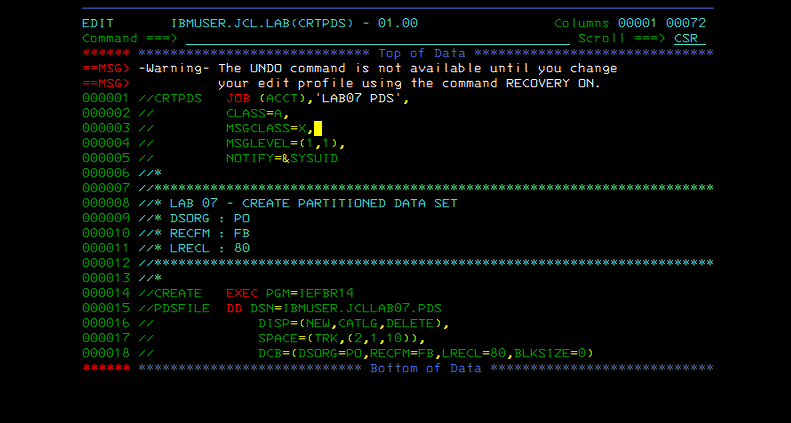
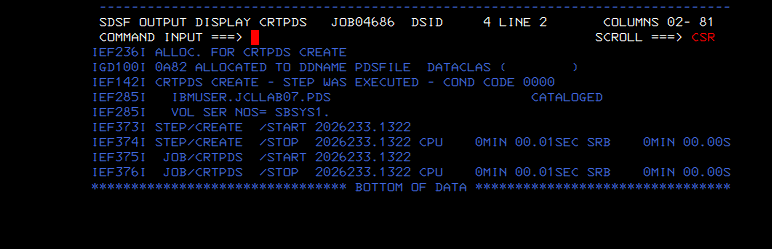
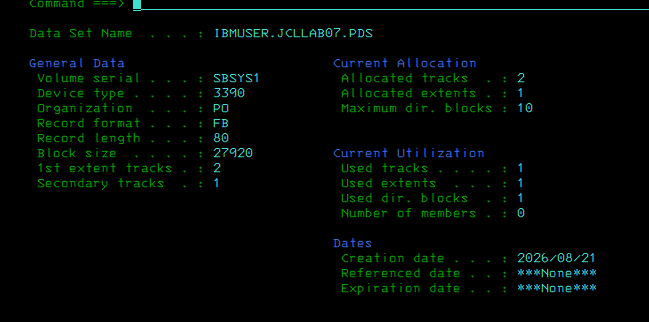
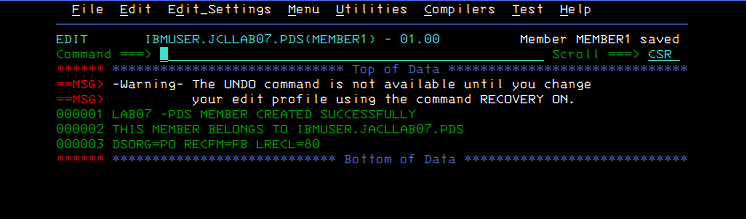
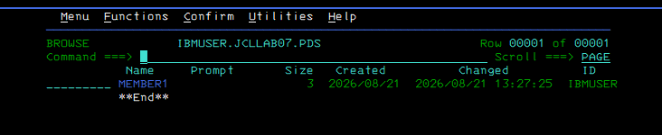
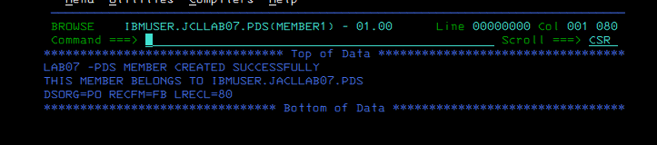

# Evidence Walkthrough — Lab 07: PDS Allocation and Member Management

[← Lab lesson](../README.md) · [Academy](https://github.com/P-dot/P-dot/blob/main/docs/ACADEMY.md)

This evidence chain moves from **allocation intent** to **cataloged PDS** to **member-level use**. The point is not merely to create a data set; it is to connect JCL allocation attributes with the object ISPF later exposes to a user.

### Evidence 01 — allocation intent

**Observe:** the DD statement requests a new data set with DISP=(NEW,CATLG,DELETE), SPACE=(TRK,(2,1,10)) and DCB=(DSORG=PO,RECFM=FB,LRECL=80,BLKSIZE=0).

**Interpret:** DSORG=PO requests a partitioned organization. The third SPACE quantity supplies directory capacity, which distinguishes this allocation from the earlier sequential-data-set exercises. BLKSIZE=0 delegates block-size selection to the system.

**Why it matters:** the JCL describes both physical allocation characteristics and the intended logical organization before any member exists.

### Evidence 02 — execution and catalog disposition

**Observe:** IEF142I reports condition code 0000 and IEF285I reports IBMUSER.JCLLAB07.PDS as CATALOGED.

**Interpret:** the allocation step completed and normal disposition processing retained the newly created data set in the catalog.

**Boundary:** CC 0000 plus CATALOGED proves successful allocation processing; it does not by itself prove that the requested attributes are exactly what the learner intended.

### Evidence 03 — inspect the resulting object

**Observe:** ISPF reports Organization PO, Record format FB, Record length 80, Block size 27920, allocated tracks and directory-block information.

**Interpret:** this is the post-allocation validation of the DD request. In particular, the displayed block size shows the system-selected value resulting from BLKSIZE=0.

**Why it matters:** good z/OS practice validates final state instead of assuming that successful JCL automatically means the object has the desired characteristics.

### Evidence 04 — create MEMBER1

**Observe:** MEMBER1 is edited inside IBMUSER.JCLLAB07.PDS and ISPF reports that the member was saved.

**Interpret:** the partitioned data set is now being used as a library: the data set is the container and MEMBER1 is a named member within it.

### Evidence 05 — directory view

**Observe:** the PDS member list contains MEMBER1 and its metadata.

**Interpret:** member-level lookup is mediated by the PDS directory rather than by creating a second cataloged data set for the member.

**Why it matters:** this distinction becomes fundamental for JCL libraries, procedure libraries, source libraries and many z/OS configuration libraries.

### Evidence 06 — content survives retrieval

**Observe:** browsing MEMBER1 returns the three records that were saved.

**Interpret:** the full lifecycle is now evidenced: allocate the PDS → catalog it → create a directory member → retrieve the member by name → verify its records.

## What happened inside z/OS

    JCL DD allocation request
             |
             v
    allocation + catalog services
             |
             v
       PDS data set
       /          \
    directory    data area
       |
    MEMBER1 entry
       |
    ISPF lookup/edit/browse

A PDS member is not independently cataloged. The catalog identifies the PDS; the PDS directory identifies members inside that data set.

## Result

**VALIDATED:** PDS allocation, cataloging, attribute verification, member creation, directory visibility and content retrieval.

## Knowledge check

1. Why does a PDS need directory space while a basic sequential data set does not?
2. What does BLKSIZE=0 delegate to the system?
3. Why is IEF285I CATALOGED useful evidence in addition to CC 0000?
4. Is MEMBER1 a separately cataloged data set? Why not?
5. Which later z/OS libraries use this same container/member mental model?

---
### Continue learning

**Course:** [JCL Engineering Labs](../../../README.md)  
**Next:** [Lab 08 Part 1 — PS/PDS data-set operations](../../08-jcl-ps-pds-data-set-operations-part-1/)  
**Related:** [TSO/ISPF](https://github.com/P-dot/MVS_TSO_ISPF)  
**Academy:** [z/OS Engineering Academy](https://github.com/P-dot/P-dot/blob/main/docs/ACADEMY.md)

The original DOCX is retained unchanged as source evidence.
